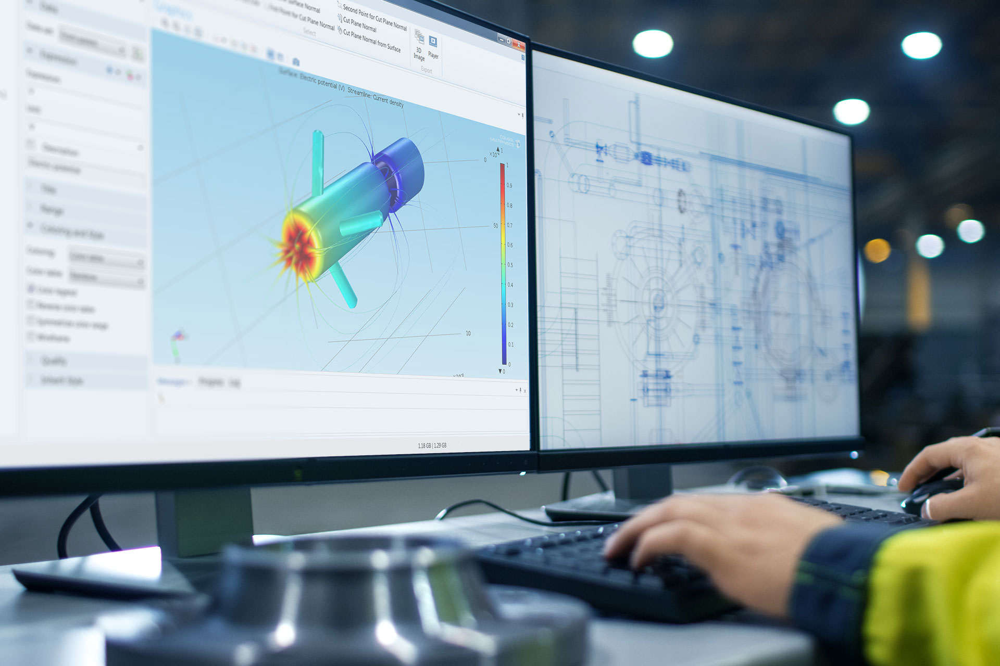

# WebPyAnsys Frontend

> Modern React + Vite single-page application for creating, monitoring, and visualizing engineering Finite Element Analysis (FEA) simulations.

<div style="text-align:center;">
  
</div>

<div style="text-align:center;margin-top:8px;">
  <a href="https://react.dev"></a>
  <a href="https://vitejs.dev"></a>
  <a href="https://tailwindcss.com"></a>
  
  
</div>

## Table of Contents
1. [Overview](#overview)
2. [Features](#features)
3. [Tech Stack](#tech-stack)
4. [Architecture](#architecture)
5. [Directory Structure](#directory-structure)
6. [Getting Started](#getting-started)
7. [.env Configuration](#env-configuration)
8. [Authentication Flow](#authentication-flow)
9. [Simulation Lifecycle](#simulation-lifecycle)
10. [Key Components](#key-components)
11. [Scripts](#scripts)
12. [Error Handling & UX](#error-handling--ux)
13. [Roadmap](#roadmap)
14. [Contributing](#contributing)
15. [License](#license)

## Overview
WebPyAnsys Frontend provides an intuitive interface for submitting structural simulation jobs, tracking their progress, inspecting results (parameters, statistics, mesh, stress & deformation images), and downloading output artifacts.

## Features
**Core**
- JWT authentication (login & registration)
- Protected routes (simulation-related pages are gated)
- Automatic access token refresh via refresh token

**Simulation Management**
- Parameter-driven simulation creation (geometry, material, load)
- Asynchronous processing with status polling
- Resume failed or pending simulations where supported

**Visualization & Results**
- Mesh / stress / deformation image previews
- Statistics (displacement & stress metrics, counts)
- Optional 3D model viewer (Three.js GLTF)
- Multi-format downloads (text, images, JSON summary)

**User Experience**
- Toast notifications (success / error / info)
- Modal & inline loading indicators
- Rich parameter tooltips & info modal

**Robustness**
- Centralized API client with interceptors
- Global error boundary with graceful fallback UI
- Environment-based configuration (no hard‑coded URLs)

## Tech Stack
| Layer | Technology |
|-------|------------|
| UI | React 18, React Router 6 |
| Build | Vite 5 |
| Styling | Tailwind CSS, (Bootstrap present – slated for removal) |
| Networking | Axios (wrapped in custom Api instance) |
| Notifications | Sonner |
| 3D | Three.js + OrbitControls + GLTFLoader |
| Tooling | ESLint 9 |

## Architecture
```
Client (React SPA)
  ├─ Routing (React Router)
  ├─ Components / Pages
  ├─ Api (Axios instance with auth & refresh interceptors)
  ├─ ProtectedRoute (auth gating)
  └─ ErrorBoundary (global runtime safety)
      │
      └── HTTP (JSON / Blob)
             │
             └── Backend (Django / PyAnsys)
                   ├─ /myapp/token/ (login)
                   ├─ /myapp/token/refresh/
                   ├─ /myapp/user/registration/
                   ├─ /myapp/simulations/ (CRUD + async submit)
                   ├─ /myapp/simulations/{id}/status/
                   ├─ /myapp/simulations/{id}/resume/
                   └─ /myapp/simulations/{id}/download/{type}/
```

## Directory Structure
```
frontend/
  public/                    Static assets (images)
  src/
    api/api.jsx              Axios instance (base URL, interceptors)
    constants.js             Token & base URL helpers
    main.jsx                 App bootstrap (Router + ErrorBoundary + Toaster)
    App.jsx                  Route definitions (protected simulation routes)
    Components/              Reusable UI & domain components
      ProtectedRoute.jsx
      ErrorBoundary.jsx
      Navbar.jsx / Footer.jsx
      Loading.jsx / LoadingModal.jsx
      SimulationForm.jsx
      SimulationList.jsx
      SimulationDetail.jsx
      SimulationDownload.jsx
      SimulationStatus.jsx
      ParametrInfoModal.jsx
      SimulationViewer(.jsx/.2D.jsx)
    Pages/                   Top-level pages (Home, Login, Register, etc.)
    index.css                Tailwind layers & base styles
  .env / .env.example        Environment configuration
  package.json               Dependencies & scripts
  vite.config.js             Vite build config
  tailwind.config.js         Tailwind config
```

## Getting Started
### Prerequisites
- Node.js ≥ 18
- Backend running (Django/PyAnsys) with CORS allowing `http://localhost:5173`

### Install & Run
```bash
npm install
npm run dev
```
Visit: http://localhost:5173

### Production Build
```bash
npm run build
npm run preview   # Serve production bundle locally
```

## .env Configuration
| Variable | Purpose | Default |
|----------|---------|---------|
| `VITE_API_BASE_URL` | Backend base URL | `http://localhost:8000` |
| `VITE_API_TIMEOUT` | Request timeout (ms) | `30000` |
| `VITE_POLLING_INTERVAL` | Simulation status polling interval (ms) | `2000` |
| `VITE_STATUS_POLLING_INTERVAL` | Secondary status polling (status page) | `5000` |
| `VITE_APP_NAME` | App display name | `WebPyAnsys` |

Restart dev server after changes.

## Authentication Flow
1. User submits login form → `POST /myapp/token/` → receives `access`, `refresh`
2. Tokens stored in `localStorage` (`access_token`, `refresh_token`)
3. Every request: Axios request interceptor adds `Authorization: Bearer <access>`
4. On 401: response interceptor attempts `POST /myapp/token/refresh/`
5. If refresh fails: tokens cleared → redirect to `/login`

## Simulation Lifecycle
1. Fill form (`SimulationForm`) & submit → `POST /myapp/simulations/`
2. Response `201` (immediate result) or `202` (queued)
3. If `202`: polling `GET /myapp/simulations/{id}/status/` until `COMPLETED` or `FAILED`
4. Details at `GET /myapp/simulations/{id}/`
5. Downloads via `/download/{type}/` endpoints

## Key Components
| Component | Responsibility |
|-----------|----------------|
| `ProtectedRoute` | Guards private routes (requires token) |
| `ErrorBoundary` | Catches render/runtime errors & renders fallback UI |
| `SimulationForm` | Parameter input, submit, tooltip/modal info, async polling trigger |
| `SimulationDetail` | Shows metadata, parameters, statistics, images, resume action |
| `SimulationDownload` | Secure multi-format result downloads (Blob handling) |
| `SimulationList` | Paginated list of user simulations (with delete) |
| `SimulationStatus` | Lightweight polling view |
| `ParametrInfoModal` | Extended parameter explanations & external docs |
| `LoadingModal` / `Loading` | Consistent loading feedback (inline & overlay) |

## Scripts
```bash
npm run dev        # Start development server
npm run build      # Production build
npm run preview    # Preview production build locally
npm run lint       # Run ESLint checks
```

## Error Handling & UX
- Global fallback via `ErrorBoundary` (DEV mode shows stack traces)
- Toast notifications for success/error/info (Sonner)
- Inline & modal loaders for responsive feedback
- Defensive API layer (auto token refresh, graceful redirect on auth failure)

## Roadmap
| Priority | Item |
|----------|------|
| High | Integrate Formik + Yup for robust form validation |
| High | Introduce React Query for data caching & stale management |
| Medium | Remove Bootstrap to slim bundle (Tailwind only) |
| Medium | Add unit tests (Testing Library already installed) |
| Medium | Migrate gradually to TypeScript |
| Medium | Improve accessibility (ARIA roles, keyboard navigation) |
| Low | Code splitting (React.lazy) for route-level chunks |
| Low | Skeleton loaders to replace spinners |
| Low | Optional i18n (react-i18next) |

## Contributing
1. Fork & clone
2. Create feature branch (`feat/my-feature`)
3. Install dependencies: `npm install`
4. Run & test locally: `npm run dev`
5. Ensure lint passes: `npm run lint`
6. Open PR with clear description

## Acknowledgements
- React ecosystem & Vite maintainers
- Tailwind CSS for rapid UI development
- Three.js for lightweight 3D visualization

---
**Quick Smoke Test After Setup**
1. Register → redirected to home (tokens stored)
2. Navigate to `/simulations/new` (protected route allows access)
3. Submit sample simulation → see toast feedback
4. Polling (if queued) → auto-navigation to detail page
5. Download a result artifact

If issues arise, check browser console & network tab, verify `.env` configuration, and confirm backend availability.

Happy simulating!
